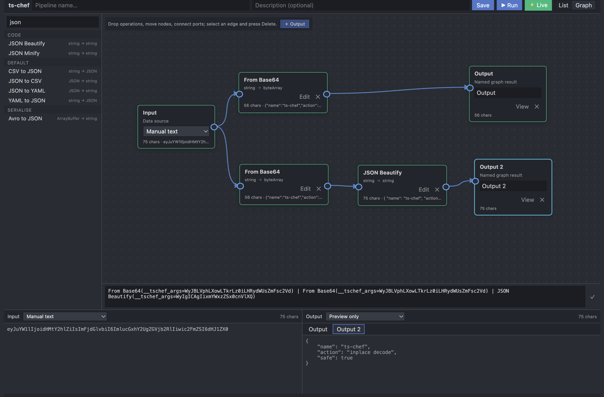
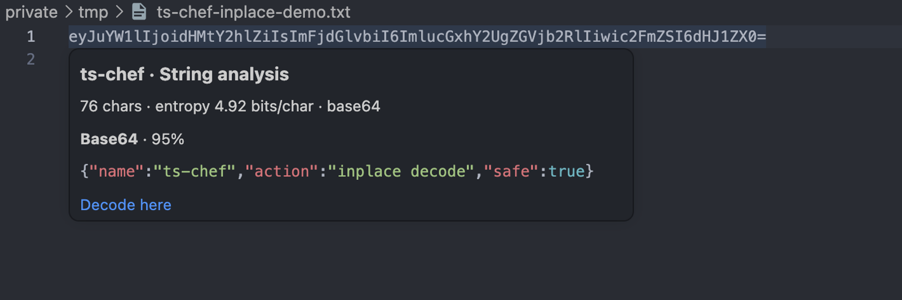
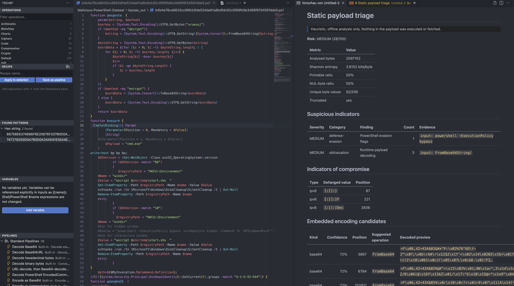
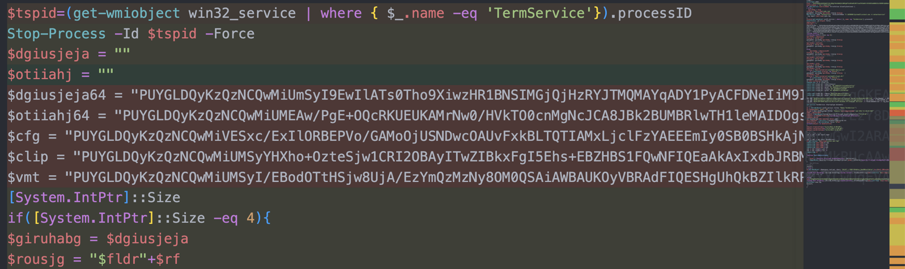
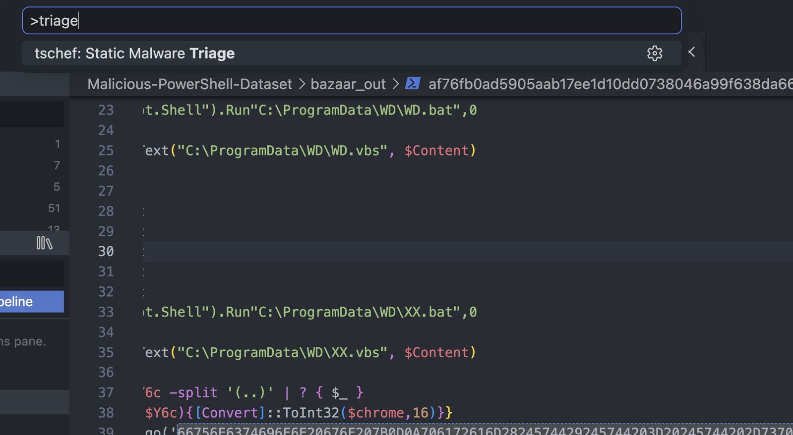

<p align="center">
  
</p>

<h1 align="center">ts-chef</h1>

<p align="center">
  <strong>CyberChef-style operations, visual pipelines, and data analysis inside Visual Studio Code.</strong><br />
  Decode, encode, format, inspect, and transform data without leaving your editor.
</p>

`ts-chef` brings a CyberChef-inspired transformation workbench next to your code. Use it for quick Base64 or hex decoding, repeatable recipes, branched pipeline graphs, in-place editor actions, pattern scanning, and bounded static analysis of suspicious files.

<p align="center">
  <a href="https://marketplace.visualstudio.com/items?itemName=MichaelWeiss.vscode-ts-chef">
    
  </a>
  <a href="https://marketplace.visualstudio.com/items?itemName=MichaelWeiss.vscode-ts-chef">
    
  </a>
  <a href="https://marketplace.visualstudio.com/items?itemName=MichaelWeiss.vscode-ts-chef">
    
  </a>
  <a href="https://github.com/MichaelWeissDEV/ts-chef/actions/workflows/ci.yml">
    
  </a>
  <a href="https://github.com/MichaelWeissDEV/ts-chef/blob/master/LICENSE">
    
  </a>
</p>

<p align="center">
  <a href="https://marketplace.visualstudio.com/items?itemName=MichaelWeiss.vscode-ts-chef"><strong>Install ts-chef from the VS Code Marketplace</strong></a>
</p>

## What is ts-chef?

`ts-chef` is a TypeScript-powered VS Code extension for CyberChef-style data transformations and analysis. It keeps the operation catalog, recipe builder, saved pipelines, encoded-value inspection, and security-oriented tooling in the same workspace as the data you are investigating.

- **423 registered operations** for encodings, ciphers, hashes, compression, structured data, images, text, and binary formats.
- **Visual list and graph editors** for reusable linear recipes, branches, and named outputs.
- **Fast editor workflows** through Quick Convert, hover previews, exact-value replacement, and saved pipelines.
- **28 bundled recipes** for common decoding, PowerShell, IOC, entropy, payload, and structured-data tasks.
- **Local core transformations** with no account required. Operations that inherently require network access only run when explicitly selected.

## A visual tour

### Build pipelines that branch

The graph editor turns a recipe into a directed acyclic graph. One input can feed multiple operation chains, nodes can be repositioned and connected through explicit ports, and each branch can end in a named output.

<p align="center">
  
</p>

Use **List** for an ordered recipe or switch to **Graph** for fan-out workflows. Live execution status and output tabs make it possible to inspect each result without flattening the graph into one linear chain.

### Decode and format with live preview

Search the real operation catalog, append steps, configure their arguments, and preview the result while editing the input. This example uses `From Base64 | JSON Beautify` to turn encoded data into readable JSON.

<p align="center">
  
</p>

Pipeline inputs can come from manual text, the editor selection or document, and the clipboard. Results can stay in the preview or be sent to the clipboard, an editor replacement, or a new document.

### Understand encoded values before changing them

Hover over a detected value to see its likely encoding, confidence, length, entropy, and a bounded decoded preview. **Decode here** replaces that exact value; Deep Analysis can follow safe multi-step decode paths for layered input.

<p align="center">
  
</p>

Integer hovers provide decimal, hexadecimal, binary, octal, bit-width, and two's-complement interpretations directly in source code.

<p align="center">
  
</p>

### Scan and triage suspicious data

Pattern scanning groups recognizable hex, Base64, hashes, JWTs, UUIDs, URLs, and other matches in the **Found Patterns** view. Matches can be highlighted in the editor and exported as JSON or CSV.

<p align="center">
  
</p>

Static malware triage performs bounded, offline inspection of selected text or the active file. It reports byte statistics, signatures, suspicious behavior patterns, defanged IOCs, embedded encodings, and extracted strings. The payload is not executed or fetched.

<p align="center">
  
</p>

The optional entropy heatmap adds line-level Shannon entropy coloring. It can help locate encoded, compressed, encrypted, or packed-looking regions, but entropy alone is not a malware verdict.

<p align="center">
  
</p>

<details>
<summary><strong>Open static malware triage from the Command Palette</strong></summary>

<p align="center">
  
</p>
</details>

## Start working with ts-chef

1. Install **ts-chef** and open its chef icon in the Activity Bar.
2. Select a value and run **`tschef: Quick Convert Selection`** (`Ctrl+Alt+C` / `Ctrl+Cmd+C`) for a one-off operation.
3. For repeated work, add operations to **Recipe** or open the full Pipeline Editor.
4. Preview the result, replace the selection, copy it, or open it in a new editor.

No account or external service is required for local transformations. VS Code `1.85.0` or newer is supported.

## Ways to work

### Quick Convert

Quick Convert applies one named operation to the selected text. It is the shortest workflow for common transformations such as `From Base64`, `To Base64`, `From Hex`, `To hex`, `URL decode`, `URL encode`, `JSON Beautify`, or `SHA2`.

### Operations and Recipe views

The **Operations** view is searchable and grouped by module. Click `＋` to add an operation to **Recipe**, expand the step to edit its arguments, and then:

- apply the complete recipe to the current selection;
- save it as a reusable global or workspace pipeline;
- load a bundled standard recipe as a starting point;
- open the recipe in the full list or graph editor.

### Pipeline syntax

Pipelines use operation display names separated by `|`:

```text
From Base64 | JSON Beautify
```

Arguments use `key=value` pairs or positional indices inside parentheses:

```text
From Base64 | To hex(Delimiter=Space) | SHA2
```

Pipe characters inside a quoted or parenthesized argument are preserved by the parser. The visual editor keeps its text representation synchronized with the configured steps.

### Saved and bundled pipelines

Saved pipelines can be run from the **Pipelines** view or through **`tschef: Run Saved Pipeline`**. The view keeps bundled **Standard Pipelines** and user-created **My Pipelines** in separate collapsible groups. The bundled catalog contains 28 searchable recipes for decoding, encoding, structured data, PowerShell, IOCs, payload inspection, entropy, string extraction, and deobfuscation.

Use **`tschef: Browse Standard Recipe Library`** to load a bundled recipe into the Recipe pane, or **`tschef: Open Saved/Standard Pipeline in Editor`** to inspect and adapt it. **`tschef: Open Pipeline Graph`** starts the full editor directly in drag-and-drop graph mode.

## Named operations

The registry currently contains 423 operations. Search by the displayed operation name in the Operations view or Pipeline Editor.

| Area | Example operation names |
| --- | --- |
| **Encoding and decoding** | `From Base64`, `To Base64`, `From Hex`, `To hex`, `URL decode`, `URL encode` |
| **Structured data** | `JSON Beautify`, `JSON Minify`, `CSV to JSON`, `JSON to YAML`, `YAML to JSON`, `XML Beautify` |
| **Hashes and crypto** | `SHA2`, `BLAKE3`, `AES Encrypt`, `JWT Decode` |
| **Compression and binary data** | `Gunzip`, `From Hexdump`, `To hexdump` |
| **Inspection and extraction** | `Entropy`, `Strings`, `Extract URLs`, `Parse URI` |
| **Security workflows** | `YARA Rules` plus editor-level pattern scanning, entropy heatmaps, Deep Analysis, and static malware triage |

The complete generated reference is available in [docs/operations.md](docs/operations.md).

## Editor analysis tools

### Instant encoded-value hovers

Hover a Base64, Base64URL, hexadecimal, URL-encoded, escaped, token, hash, or similar value to see its likely type, confidence, string statistics, and a bounded decoded preview without running a prior scan. **Decode here** replaces that exact occurrence.

Long Base64 and hex tokens keep preview work bounded while the action remains associated with the complete token, up to the configured safety limit. This avoids accidentally replacing only the visible middle of a long value. When decode-chain previews are enabled, the hover can also follow safe, bounded multi-step candidates.

### Source-code integer calculator

The integer hover recognizes hexadecimal, binary, octal, and decimal literals in C/C++, Rust, Python, JavaScript/TypeScript, Go, and related languages. Literals such as `0xffu8`, `0b1111_0000`, `0755`, and `1_000_000` show:

- decimal, hexadecimal, binary, and octal representations;
- inferred bit width and two's-complement bits;
- signed and unsigned interpretations;
- one-click replacements in the selected source radix.

### Deep Analysis and pattern scanning

**`tschef: Deep Analysis of Selection`** recursively identifies encodings and follows bounded decode chains such as Base64 to Gunzip. Every candidate includes a decoded preview and statistics such as length, entropy, and character set before anything is applied.

**Scan Document for Patterns** and **Scan Workspace for Patterns** find recognizable Base64, hex, hashes, JWTs, UUIDs, URLs, and other structured values. Results are grouped by file in **Found Patterns**, can be highlighted or hovered in the editor, and can be exported as JSON or CSV. The view follows the active editor by default; use the eye button in its title bar to pin the current result set.

### Security-oriented inspection

- **YARA scanning** runs rules from a `.yar` file or inline rules against the current selection or document.
- **Static malware triage** performs bounded, offline inspection of selected text or the active binary file. It reports byte statistics and entropy, file signatures, defanged IOCs, suspicious script, LOLBin, persistence and injection patterns, embedded encoding candidates, and extracted ASCII or UTF-16 strings in a Markdown report.
- **Entropy heatmap** optionally colors source lines and the minimap by Shannon entropy to reveal packed, encrypted, compressed, or encoded-looking regions.

These tools support static investigation; they do not execute or fetch a payload, and their heuristic findings are not a substitute for a sandbox or a malware verdict.

### Smart Format and Make Readable

**`tschef: Smart Format (Auto-Detect & Beautify)`** detects JSON, XML/HTML, SQL, CSS, or JavaScript and opens a pretty-printed copy in a new editor. **Make Readable** reflows extremely long hex, Base64, or delimiter-heavy one-line blobs to the configured width without changing the underlying data.

## Pipeline editor details

The Pipeline Editor supports both an ordered **List** and a true directed acyclic **Graph**. An ordered pipeline initially appears as a linear graph, then can be expanded with freely positioned operation nodes, explicit ports, fan-out branches, and multiple named outputs.

- The selected output defines the primary ordered path while the complete graph topology and layout remain stored with the saved pipeline.
- Node status updates during execution, and output tabs expose every named result.
- Inputs can come from manual text, the editor selection, the active document, or the clipboard.
- Results can remain in preview, be copied, replace editor text, or open in a new document.
- Live preview is limited to bounded, deterministic operations on manual input. Networked, expensive, random, file-oriented, and malware-analysis operations require an explicit **Run**.

## Variables, scopes, and export

Variables are referenced explicitly as `{{name}}` and can be saved globally or for the current workspace. Shell and PowerShell expressions such as `$name` remain verbatim instead of being treated as ts-chef variables. Pipelines have the same global or workspace storage scopes.

Workspace-scoped variables and pipelines are unavailable while VS Code is in Restricted Mode. Pattern-scan results can be exported to JSON or CSV for follow-up analysis or reporting.

## Installation and workspace views

Install [ts-chef from the Visual Studio Marketplace](https://marketplace.visualstudio.com/items?itemName=MichaelWeiss.vscode-ts-chef), or search for `ts-chef` in the VS Code Extensions view. Visual Studio Code `1.85.0` or newer is required.

Open the ts-chef chef icon in the Activity Bar to access **Operations**, **Recipe**, **Found Patterns**, **Variables**, and **Pipelines**. All extension commands are also available from the Command Palette under the `tschef:` prefix.

## Privacy and safety

- Core transformations execute inside the extension and do not require an account.
- Hover and live-preview work is bounded to keep the editor responsive.
- Networked, expensive, random, file-oriented, and malware-analysis operations require an explicit run in the Pipeline Editor.
- Static malware triage never executes or fetches a payload.
- Workspace-scoped variables and pipelines are disabled in VS Code Restricted Mode.

## Settings

The following settings are available under the `tschef.` namespace:

| Setting | Default | Description |
| --- | ---: | --- |
| `tschef.highlightingEnabled` | `true` | Highlight detected patterns in the editor. |
| `tschef.confidenceThreshold` | `0.65` | Minimum confidence for hover conversion options. |
| `tschef.hover.enabled` | `true` | Enable instant encoded-string and integer-literal hovers. |
| `tschef.hover.onDemand` | `true` | Analyze the line under the cursor without requiring a document scan. |
| `tschef.hover.integerCalculator` | `true` | Show radix and two's-complement information for integer literals. |
| `tschef.hover.decodeChains` | `true` | Offer bounded multi-step decode previews. |
| `tschef.hover.maxInputCharacters` | `65536` | Maximum input characters analyzed for one hover preview. |
| `tschef.hover.maxPreviewCharacters` | `320` | Maximum decoded characters shown in a hover preview. |
| `tschef.autoScanOnSave` | `false` | Scan documents automatically when they are saved. |
| `tschef.patterns.followActiveEditor` | `true` | Let Found Patterns follow the active editor; disable it to pin results. |
| `tschef.patterns.autoScanOnFocus` | `false` | Scan a document the first time it becomes active while following. |
| `tschef.entropyMap.enabled` | `false` | Color lines by Shannon entropy. |
| `tschef.readableLineWidth` | `100` | Target width used by Make Readable. |
| `tschef.pipelineResultAction` | `popup` | Present results as `popup`, `replace`, `copy`, `inline`, or `panel`. |
| `tschef.defaultPipelineScope` | `global` | Default storage scope for a saved pipeline. |
| `tschef.defaultVariableScope` | `global` | Default storage scope for a saved variable. |

## Commands worth knowing

| Command | Default shortcut |
| --- | --- |
| `tschef: Quick Convert Selection` | `Ctrl+Alt+C` / `Ctrl+Cmd+C` |
| `tschef: Run Saved Pipeline` | `Ctrl+Alt+R` / `Ctrl+Cmd+R` |
| `tschef: Smart Format (Auto-Detect & Beautify)` | `Ctrl+Alt+F` / `Ctrl+Cmd+F` |
| `tschef: Open Pipeline Editor` | Command Palette |
| `tschef: Open Pipeline Graph` | Command Palette |
| `tschef: Deep Analysis of Selection` | Editor context menu |
| `tschef: Static Malware Triage` | Command Palette |
| `tschef: Browse Standard Recipe Library` | Command Palette |
| `tschef: Scan Document for Patterns` | Command Palette |
| `tschef: Scan Workspace for Patterns` | Command Palette |
| `tschef: YARA Scan Selection/Document` | Command Palette |
| `tschef: Toggle Entropy Heatmap` | Command Palette |

Every command is available from the Command Palette under the `tschef:` prefix.

## Documentation

- [GitHub repository](https://github.com/MichaelWeissDEV/ts-chef)
- [Usage guide](docs/usage.md)
- [Operations reference](docs/operations.md)
- [Contributing guide](docs/contributing.md)
- [Changelog](CHANGELOG.md)

## Development

```bash
git clone https://github.com/MichaelWeissDEV/ts-chef.git
cd ts-chef
npm install
```

Common development commands:

```bash
npm run build     # bundle the extension with esbuild
npm test          # run the Jest test suite
npm run lint      # run ESLint
npm run package   # build a .vsix package
```

Project layout:

| Path | Purpose |
| --- | --- |
| `src/extension.ts` | VS Code extension entry point: commands, providers, and wiring. |
| `src/chef/` | TypeScript operation engine. |
| `src/chef/operations/` | Individual transformation operations. |
| `src/providers/` | Sidebar, hover, scan, decoration, magic, entropy, and formatting providers. |
| `src/commands/` | Pipeline runner and result presentation. |
| `src/panels/` | List and graph Pipeline Editor webview. |
| `test/` | Jest test suite. |

## License

Licensed under the [Apache License 2.0](LICENSE). Many operations are ported from [GCHQ CyberChef](https://github.com/gchq/CyberChef), which is also licensed under Apache 2.0.
