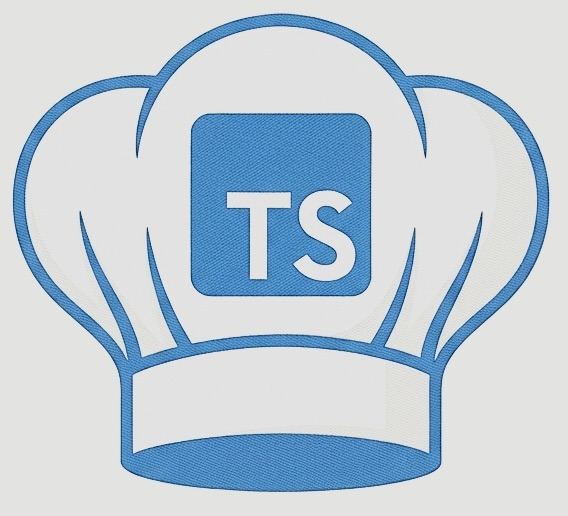

# ts-chef documentation

```{raw} html
<div class="hero">
  
  <p><strong>CyberChef-style transformations, visual pipelines, and data analysis inside Visual Studio Code.</strong></p>
</div>
```

ts-chef brings 479 encoding, decoding, cryptography, compression, formatting, binary, image, and analysis operations into Visual Studio Code. Use one operation on a selection, assemble reusable recipes, build branched graph pipelines, inspect suspicious content, or bind a workflow to your own keyboard shortcut—all without leaving the editor.

::::{grid} 1 2 2 2
:gutter: 3

:::{grid-item-card} Install and start
:link: getting-started
:link-type: doc

Install ts-chef and complete your first Base64-to-JSON transformation.
:::

:::{grid-item-card} Build a pipeline
:link: pipelines
:link-type: doc

Learn list syntax, arguments, graph branches, named outputs, inputs, and result actions.
:::

:::{grid-item-card} Analyze data
:link: analysis
:link-type: doc

Use hovers, pattern scans, entropy maps, Deep Analysis, YARA, and static malware triage safely.
:::

:::{grid-item-card} Find an operation
:link: operation-catalog
:link-type: doc

Browse the complete, generated catalog of every registered operation by category.
:::
::::

```{admonition} Local by default
:class: tip
Core transformations run in the VS Code extension host and require neither an account nor an external service. Operations that inherently use the network run only when you explicitly select them.
```

## Documentation map

```{toctree}
:maxdepth: 2
:caption: Start here

overview
getting-started
visual-tour
usage
```

```{toctree}
:maxdepth: 2
:caption: User guide

pipelines
analysis
variables
shortcuts
configuration
commands
troubleshooting
```

```{toctree}
:maxdepth: 2
:caption: Reference

operations
operation-catalog
privacy-security
```

```{toctree}
:maxdepth: 2
:caption: Project

architecture
performance
contributing
documentation
changelog
license
```

## Project links

- [Install from the Visual Studio Marketplace](https://marketplace.visualstudio.com/items?itemName=MichaelWeiss.vscode-ts-chef)
- [Source code and issue tracker](https://github.com/MichaelWeissDEV/ts-chef)
- [Release history](https://github.com/MichaelWeissDEV/ts-chef/releases)
- [Apache License 2.0](https://github.com/MichaelWeissDEV/ts-chef/blob/master/LICENSE)
