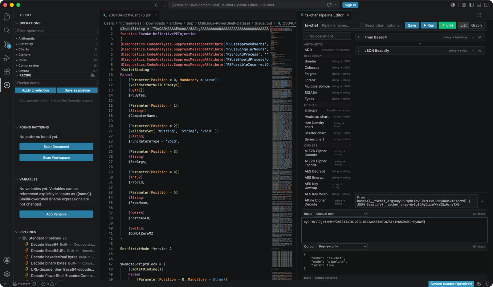
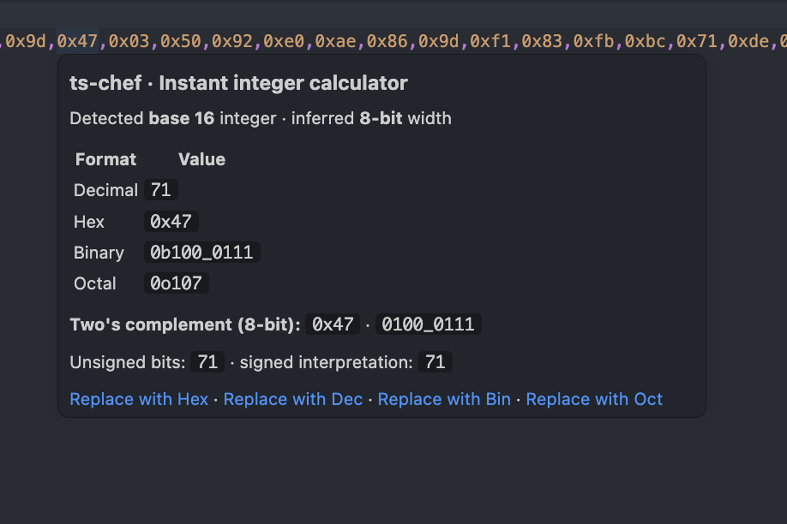
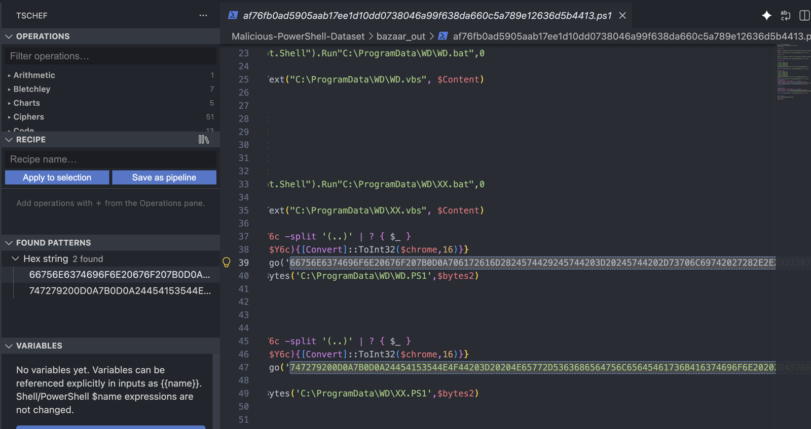

# Visual tour

## Branched graph pipelines

Graph mode turns one input into a directed acyclic workflow. Connect explicit ports, fan a result into independent branches, position nodes freely, and publish several named outputs.

Use {doc}`pipelines` for graph validation, inputs, result destinations, saved topology, and live-run policy.

## Ordered pipelines with live preview

List mode is optimized for a traditional sequence. Search all registered operations, add and reorder steps, edit argument controls, and inspect a bounded live preview when the workflow is eligible.

## Encoded-value hover

Hover analysis identifies likely encodings, reports confidence and statistics, and shows a bounded decoded preview before modifying the source.

## Source-code integer calculator

Language-aware integer hovers show radix conversions, width, signed/unsigned values, and two's-complement interpretations.

## Pattern scanning

Document and workspace scans group recognizable values in Found Patterns. Results can be navigated, highlighted, pinned, refreshed, and exported.

## Static malware triage

The Command Palette exposes bounded, offline static triage for selected text or the active file.

The resulting Markdown report combines byte statistics, signatures, suspicious behaviors, defanged IOCs, encodings, and extracted strings without executing the content.

## Entropy heatmap

Optional line and minimap coloring helps locate regions with unusually high Shannon entropy. Entropy is a clue, not a classification.

Read {doc}`analysis` for bounds, settings, interpretation guidance, YARA scanning, and Deep Analysis.
